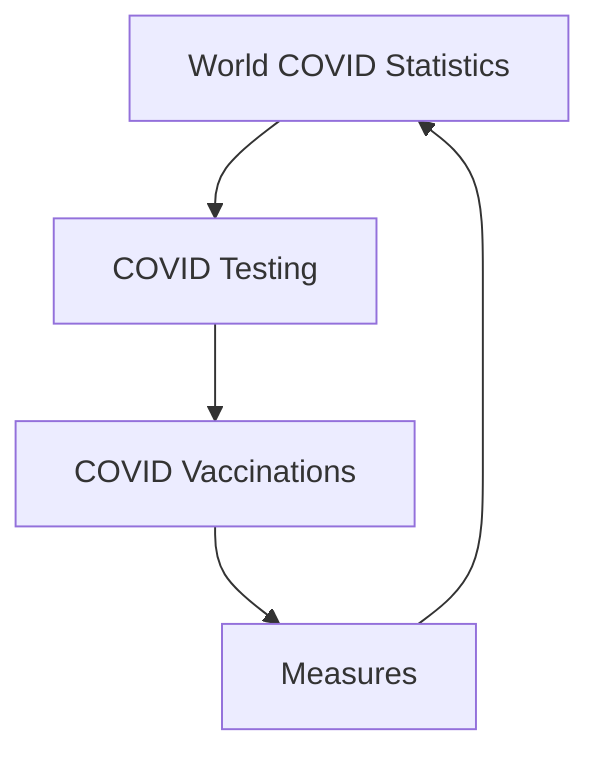

# **World Covid Statistics Dashboard**

This is my first Dashboard created on Excel as a part of my Excel Dashboarding Assignment with [Board Infinity](https://www.boardinfinity.com/)

Access original file here
[Google link to Dashboard](https://docs.google.com/spreadsheets/d/1KEnQ9J2KEICfpnYzn-7MvP7di2RHA4yA/edit?usp=sharing&ouid=117081134220231896233&rtpof=true&sd=true)

**Objectives of Dashboarding**
- Solve 10-15 self-formulated Problem Statements over the Dataset
- Make use of different charts to provide clear and crisp fact-telling
- Use creativity and design sense to make a visually appealing and dynamic Dashboard
- Develop Insights and provide Final Conclusion

**Dataset Source**

The data was picked up from the following Kaggle page 

[COVID 19 Dataset](https://www.kaggle.com/georgesaavedra/covid19-dataset)

## Dashboard Flowchart

## Demo

### Dashboard 1: World COVID Statistics

- The user can select region of his choice on the dynamic map as per his choice
- Several Static Cards show data at global level and Top 10 Countries in various counters

### Dashboard 2: COVID Testing

- Selection of country from right slicer changes the graphs dynamically to seected country data
- Static cards show data at global level and Top 10 Countries for the mentioned counter
- Similary Dashboard 3 and 4 depict data for Vaccination and Measures

## Understanding Insights
The repository contains Powerpoint presentation describing the project in detail while it also makes one understand the insights derived from the project and the problem statment that have been approached

